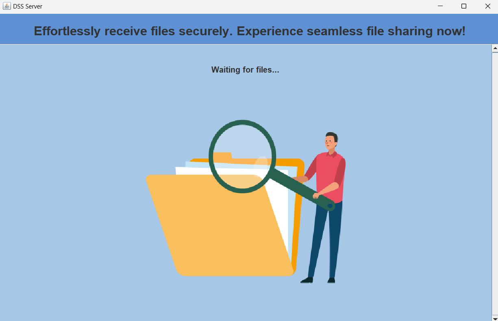
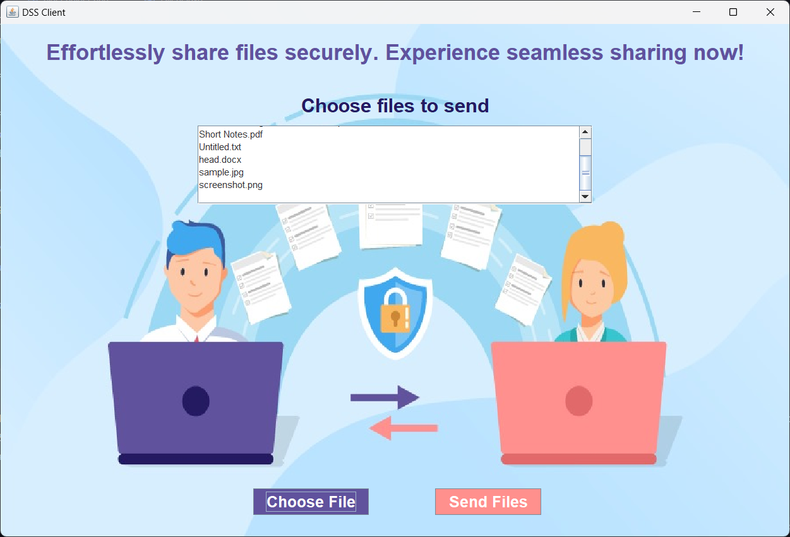
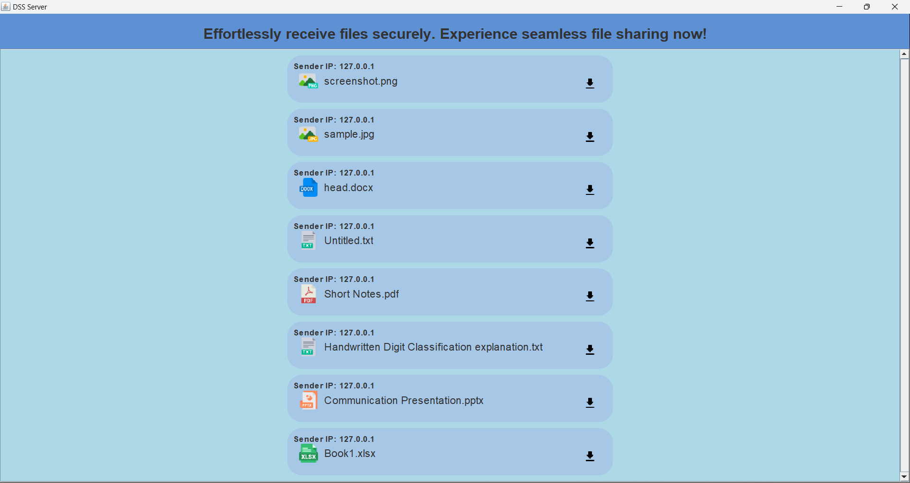

# Document Sharing Application using Java Socket Programming

## Overview
This project is a Document Sharing Application developed using Java Socket Programming. It features a graphical user interface (GUI) built with JFrame, enabling multiple clients to share single or multiple files of any type with a central server. The server can then download these files to a designated location on the server's system.

## Features
- **Multi-client Support:** Allows multiple clients to connect to the server and share files simultaneously.
- **File Type Flexibility:** Supports sharing of files of any type, including documents, images, videos, and more.
- **Graphical User Interface:** User-friendly interface using JFrame for ease of operation.
- **Server-Side Management:** The server can receive and download files to a specified directory, managing incoming files efficiently.

## Technologies Used
- **Java:** Core programming language for implementing the application logic and networking.
- **Java Socket Programming:** For handling network communication between clients and the server.
- **JFrame:** For creating the graphical user interface of the application.

## Usage
1. **Run the Server:** Start the server application, which will listen for incoming client connections.
2. **Connect Clients:** Multiple clients can connect to the server through the client application interface.
3. **Share Files:** Clients can select and send files to the server. The server will receive these files and save them to the desired location.

## How to Run
1. **Clone the Repository:**
   ```bash
   git clone https://github.com/H-Neethika/Document_Sharing_Java_Socket_Programming_Application.git

2. **Navigate to the Project Directory:**
   ```bash
   cd Document_Sharing_Java_Socket_Programming_Application

3. **Start the Server & Client Individually**
   

   

   
   
